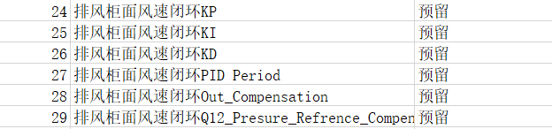

# Trox串口屏

## 1. 485通信协议
> 详细说明，参照《Trox 485通讯协议.docx》、《参数.xlsx》
### 1.1 标准报文格式 
 | Byte0   | Byte1  | Byte2  | Byte3  | Byte4―Byte11 | Byte12 | Byte13 |
 |:-----   | :----- | :----  | :----- | :----        | :----  | :-----| 
 | 起始帧1 | 起始帧2 | 命令字 | 源地址 | 数据域        | 优先级 | 校验和 |
    1.起始帧1：始终为0xAA。
    2.起始帧2：始终为0x55。
    3.命令字：需目标终端执行的动作指令。
    4.源地址：报文发送端的ID。
        * 控制板：0xA5
        * 房间触摸屏：0x5A
    5.数据域：8字节的数据信息，多字节数据则低字节在前。
    6.优先级：暂默认为0x0C，为扩展报文优先级的功能做预留。
    7.校验和：Byte0到Byte12做求和运算后，取低八位
### 1.2 主要指令
* 0xA0 ：读控制板数据1
* 0xA1 ：读控制板数据2
* 0x03 ：开关机（数据域不同）
* 0x07 ：读数据，数据域（Byte4）对应读取参数地址（对照参数表）
* 0x08 ：写数据，数据域（Byte4）对应写入参数地址（对照参数表）
> 修改报警声持续时间：AA 55 08 5A 42 00 00 00 00 00 00 00 0C AF 


## 2 页面功能
### 2.1 Program.s
* 全局变量：标志位、中间量、数据值、命令解析发送相关
* 系统设置：波特率、亮度、休眠/唤醒、解析模式、掉电存储、恢复出厂
### 2.2 全局功能
**屏保** ：触摸捕捉、定时器组件
> 返回上一页，参考官网示例dp、lastpage

**语言切换**：跳转中/英页面

**故障显示**：AA 55 A2 5A 00 00 00 00 00 00 00 00 0C 07

**通讯连接**：若50ms后仍无应答，连续发送50次，仍未收到应答则超时退出，并反馈通讯超时报警

**按键声音**：双击切换 
### 2.3 主页面

**紧急工况**：AA 55 03 5A ?04 00 AA AA 00 00 00 00 0C ##(计算校验和) 

**夜间模式/节能排风**：AA 55 03 5A ?05 00 AA AA 00 00 00 00 0C ##(计算校验和) 

**正常模式**： AA 55 03 5A 00 00 AA AA 00 00 00 00 0C

**开关阀门**：系统启停
    * 开机：AA 55 03 5A 00 00 AA AA 00 00 00 00 0C
    * 关机：AA 55 03 5A 00 00 55 55 00 00 00 00 0C

**设置页面** ：跳转

**参数显示**：AA 55 A0 5A 00 00 00 00 00 00 00 00 0C 05 
* 实际面风速：
* 门高：?
* 压力：?

### 2.4 设置页面
* 用户设置
  * 键盘?
* 视窗设置
* 系统参数
* 高级参数
* 系统标定
* 自动视窗
* 版本信息
* 错误代码说明
* 系统备份还原

### 2.5用户设置
* 锁屏时间（秒）
* 屏保时间（秒）1000
* 工作面风速0.50m/s
* 节能面风速0.30m/s
* 面风速容差0.03m/s
* 风速报警比例12%
* 最小风量220m3/h
* 最大风量1500m3/h
* 紧急风量700m/h
* 夜间风量500m/h
* 固定模式风量220m3/h
* 门高上线报警500mm
* 风量报警比例8%
* 停机阀门开度25%
* 辅助风机阈值800m3/h

### 2.6 用户设置
* 柜门宽度1500mm
  
### 2.7 系统参数
* 控制模式设置：位移传感器
* 系统架构设置：独立控制
* 启停方式设置：无需启停
* 警报时长（秒）：关闭
* 设备地址：1（拨码）

### 2.8 高级参数
* PID-KP：600
* PID-KI：200
* PID-KD：200
* PID-Period：35
* PID-Out-Comp：12
* PID-Ref-Comp：20

### 2.9 系统标定
* 门高10cm校准
* 门高30cm校准
* 门高50cm校准

### 2.10 自动视窗
* 自动打开高度：10
* 自动关闭高度：10
* 最大速度：10
* 最小速度：10
* 减速距离：10

### 2.11 版本信息
* 面板硬件版本 ?还需要吗
* 面板软件版本
* 阀硬件版本：V3.1.2
* 阀软件版本：V2.3.12

### 2.12 错误代码说明

### 2.13 系统参数备份还原
>串口屏设置的参数保存，开机时重新向下位机写入？先写入再读取？


## 3 代码编写

### 3.1 Projram.s

//数据帧解析


### 3.2 屏保
**功能：**
* 可使能禁止:设置标志位或调最大屏保时间
* 屏保时间设置
```
//projram.s
int lastpage
int Screen_Count

//触摸捕捉：
Screen_Count=屏保时间设置
//屏保定时器
if(Screen_Count<=0)
{
    page 屏保
}else
{
    Screen_Count--
}
//页面离开事件
lastpage=dp

//屏保
//前初始，调整亮度
dim=5
//页面离开
dim=100//从掉电储存读取
//屏保动画


